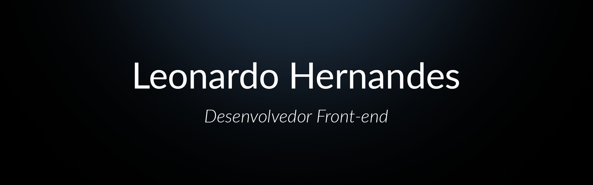

<table align="left">
  <tr>
    <td height="50px">
      <b>
        <a href="README.md">Português 🇧🇷</a>
      </b>
    </td>
    <td height="50px">
      <a href="readme-en.md">English 🇺🇸</a>
    </td>
  </tr>
</table>

  

  

 

## Leonardo Hernandes

<ul>
  <li>💙 Olá! Sou Leonardo Quental, um apaixonado por Programação e Artes Marciais.</li>
  <li>💻 Com mais de <b>2 anos de experiência</b>, tenho autonomia em diversas tecnologias Front-end mais relevantes do mercado.</li>
  <li>📈 Estou me especializando em Front-end, mas também tenho noções de Back-end e Mobile, o que me permite colaborar em projetos abrangentes.</li>
  <li>🚀 Atualmente, estou focado em evoluir constantemente em React e todo o ecossistema do Front-end.</strong></li>
  <li>🥋 Fora da programação, encontro equilíbrio nas artes marciais, onde aplico a disciplina e dedicação que também levo para o desenvolvimento de software.</li>
</ul>
 

## Minhas Stacks
<table align="left" height="255px">
  <tr>
    <td align="center">
      <a href="https://developer.mozilla.org/en-US/docs/Web/HTML/">
         
        
          <b>
            <pre>HTML5</pre>
          </b>
        
      </a>
    </td>
    <td align="center">
      <a href="https://developer.mozilla.org/en-US/docs/Web/CSS/">
         
        
          <b>
            <pre>CSS3</pre>
          </b>
        
      </a>
    </td>
    <td align="center">
      <a href="https://developer.mozilla.org/en-US/docs/Web/JavaScript/">
         
        
          <b>
            <pre>Javascript</pre>
          </b>
        
      </a>
    </td>
    <td align="center">
      <a href="https://www.typescriptlang.org/">
         
        
          <b>
            <pre>Typescript</pre>
          </b>
        
      </a>
    </td>    
    <td align="center">
      <a href="https://nextjs.org/">
         
        
          <b>
            <pre>Next.js</pre>
          </b>
        
      </a>
    </td>
    <td align="center">
      <a href="https://styled-components.com/">
         
        
          <b>
            <pre>Styled Components</pre>
          </b>
        
      </a>
    </td>
      <td align="center">
        <a href="https://nodejs.org/en">
           
          
            <b>
              <pre>Node.js</pre>
            </b>
          
        </a>
      </td>
    <td align="center">
      <a href="https://tailwindcss.com/">
       
      
        <b>
          <pre>Tailwind CSS</pre>
        </b>
      
      </a>
    </td>
  <td align="center">
    <a href="https://firebase.google.com/">
       
      
        <b>
          <pre>Firebase</pre>
        </b>
      
    </a>
  </td>
  <td align="center">
    <a href="https://sass-lang.com/">
       
      
        <b>
          <pre>Sass</pre>
        </b>
    </a>
    
  </td>
  </tr>
</table>
        

## Contato

  

  
  
  
  
  
  

  

## Projetos

<table height="495px" align="right">
  <tr>
    <td>
    
    </td>
  </tr>
</table>
                        

## Atividades

  
  

  

 

  

